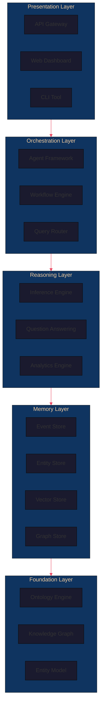

<p align="center">
  <picture>
    <source media="(prefers-color-scheme: dark)" srcset="docs/architecture/diagrams/logo-dark.svg">
    
  </picture>
</p>

<h1 align="center">Awren Core</h1>

<p align="center">
  <strong>Cognitive Operating System for Institutional Intelligence</strong>
</p>

<p align="center">
  <em>Ontology-driven · Graph-native · Event-sourced · Multi-agent</em>
</p>

<p align="center">
  <a href="#-architecture"><strong>Architecture</strong></a> ·
  <a href="#-core-concepts"><strong>Concepts</strong></a> ·
  <a href="#-getting-started"><strong>Getting Started</strong></a> ·
  <a href="#-roadmap"><strong>Roadmap</strong></a> ·
  <a href="docs/"><strong>Docs</strong></a>
</p>

---

## Mission

Awren Core is building the **operating system for institutional intelligence** — a cognitive architecture that captures, organizes, reasons over, and activates the complete knowledge of an organization.

We believe that every organization deserves an institutional memory that:
- **Persists** beyond any individual
- **Reasons** across domains and time
- **Composes** knowledge from disparate sources
- **Evolves** with the organization

## Vision

A future where organizations operate with the same coherence, memory, and intelligence as a living mind — where institutional knowledge is never lost, decisions are always context-aware, and intelligence compounds over decades.

The first vertical implementation is **Construction Brain**, bringing institutional intelligence to the built environment.

## Architecture



### Layer Architecture

| Layer | Components | Responsibility |
|-------|-----------|----------------|
| **Foundation** | Ontology Engine, Knowledge Graph, Entity Model | Semantic grounding, data typing |
| **Memory** | Event Store, Entity Store, Vector Store, Graph Store | Persistent, temporal, contextual memory |
| **Reasoning** | Inference Engine, QA, Analytics | Logical, statistical, hybrid reasoning |
| **Orchestration** | Agent Framework, Workflow Engine, Query Router | Task decomposition, agent coordination |
| **Presentation** | API, Dashboard, CLI | Human and machine interfaces |

## Core Concepts

### Ontology-First
Every piece of data is typed against a formal OWL 2 ontology before it enters the system. Ontologies provide the semantic foundation for reasoning, validation, and cross-domain integration.

### Graph-Native
The graph is not a layer on top of a relational database — the graph is the fundamental data structure. All storage, queries, and reasoning operate natively on the graph using RDF/OWL and property graph models.

### Event-Driven Memory
State is derived from events. Every change is an event in the append-only event log. The current state is always replayable from the event history, providing complete auditability.

### Composable Intelligence
Intelligence comes from composition of specialized components — ontology engine + memory + reasoning + agents = Company Brain. Each component is independently deployable and testable.

### Domain Adaptability
The core architecture is domain-agnostic. Domain-specific extensions are pluggable via ontologies and agent configurations. The first domain implementation is **Construction Brain**.

## Repository Structure

```
awren-core/
├── apps/                    # Application deployments
│   ├── api/                 # FastAPI REST API
│   ├── dashboard/           # Next.js web dashboard
│   └── cli/                 # Python CLI tool
├── packages/                # Core Python packages
│   ├── core/                # Base entity, event, relationship models
│   ├── ontology/            # OWL 2 ontology management
│   ├── memory/              # Event-sourced memory architecture
│   ├── reasoning/           # Multi-modal reasoning engine
│   ├── agents/              # Multi-agent orchestration framework
│   ├── ingestion/           # Document and data ingestion pipeline
│   ├── observability/       # Metrics, tracing, monitoring
│   └── sdk/                 # External developer SDK
├── domains/                 # Domain-specific implementations
│   └── construction/        # Construction Brain ontology and logic
├── docs/                    # Documentation
│   ├── architecture/        # Architecture documentation
│   ├── adr/                 # Architecture Decision Records
│   ├── rfc/                 # Request for Comments
│   ├── specifications/      # Detailed specifications
│   ├── roadmaps/            # Product and research roadmaps
│   ├── changelogs/          # Release changelogs
│   ├── onboarding/          # Developer onboarding guides
│   ├── standards/           # Engineering standards
│   └── benchmarks/          # Performance benchmarks
├── research/                # Academic and applied research
│   ├── papers/              # Research papers
│   ├── ontology/            # Ontology research
│   ├── memory/              # Memory architecture research
│   ├── cognition/           # Cognitive architecture research
│   └── construction/        # Construction domain research
├── infrastructure/          # Infrastructure configuration
│   ├── docker/              # Dockerfiles and compose
│   ├── postgres/            # PostgreSQL configuration
│   ├── neo4j/               # Neo4j configuration
│   └── qdrant/              # Qdrant configuration
├── .github/                 # GitHub configuration
│   ├── workflows/           # CI/CD pipelines
│   ├── ISSUE_TEMPLATE/      # Issue templates
│   └── PULL_REQUEST_TEMPLATE/
├── scripts/                 # Development and ops scripts
└── tests/                   # Test suites
```

## Getting Started

### Prerequisites

- Python 3.12+
- Poetry
- Docker & Docker Compose
- Node.js 20+ (for dashboard)

### Installation

```bash
# Clone the repository
git clone https://github.com/awren-labs/awren-core.git
cd awren-core

# Install Python dependencies
poetry install

# Start infrastructure
make infra-up

# Run database migrations
make migrate

# Start the API
make api-dev
```

### Quick Start

```python
from awren_core import AwrenCore
from awren_ontology import OntologyRegistry

# Initialize the core
core = AwrenCore()

# Load the construction ontology
ontology = OntologyRegistry.load("construction")

# Start reasoning
result = core.query("What are the active risks in Project Alpha?")
print(result)
```

## Development Workflow

```bash
# Run tests
make test

# Run linter
make lint

# Run type checker
make typecheck

# Build documentation
make docs

# Run all checks before commit
make precommit
```

## Roadmap

| Phase | Focus | Timeline |
|-------|-------|----------|
| R1 Foundation | Core entity model, ontology engine, knowledge graph | Q3-Q4 2026 |
| R2 Ontology | Full OWL2 support, SHACL validation, ontology versioning | Q4 2026 |
| R3 Memory | Event sourcing, episodic/semantic/procedural memory | Q1-Q2 2027 |
| R4 Reasoning | Multi-modal reasoning, Q&A, inference engine | Q2-Q3 2027 |
| R5 Ag
